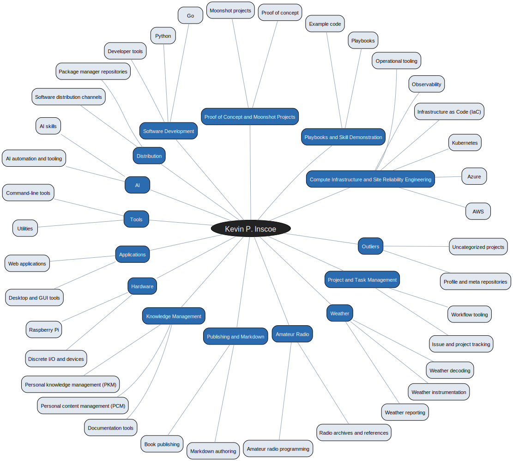

# Kevin P. Inscoe

I am a software engineer, SRE, principal SWE, Linux engineer, prolific application
and tool developer, and technical hobbyist. I have 42 years of experience building
infrastructure. I currently have 140 private Gitea repositories of applications and
tools not shown here. Some of those will be migrated here soon.

This page is a map of my work and interests — a curated knowledge map and categorized project catalog, not a performance dashboard. It does not track stars, forks, followers, or activity.

## Knowledge map

## Compute Infrastructure and Site Reliability Engineering

AWS, Azure, Kubernetes, infrastructure as code, observability, and operational tooling.

- [AWS](https://github.com/kevinpinscoe/AWS) — AWS infrastructure notes and examples.
- [aws-linux-memory-tools](https://github.com/kevinpinscoe/aws-linux-memory-tools) — Some tools to determine if your AWS Linux instance is too small
- [fedora-notes](https://github.com/kevinpinscoe/fedora-notes) — Notes and observations on using Fedora KDE Plasma as a development desktop.
- [iac-examples](https://github.com/kevinpinscoe/iac-examples) — Some examples of Infrastructure as Code (IaC)

## Playbooks and Skill Demonstration

Playbooks, conventions, and example code that demonstrate how I work.

- [playbook](https://github.com/kevinpinscoe/playbook) — Workflows, structures, scripts, and operational practices I use in daily engineering work and life.

## Proof of Concept and Moonshot Projects

Experiments, sandboxes, and difficult long-term projects.

- [moonshot-projects](https://github.com/kevinpinscoe/moonshot-projects) — a public collection of difficult, long-term projects where I am documenting the goal, constraints, partial solutions, existing tools, and areas where outside help or collaboration would be useful.
- [my-sandbox](https://github.com/kevinpinscoe/my-sandbox) — Git sandbox testing for various things
- [python-docker-fun](https://github.com/kevinpinscoe/python-docker-fun) — Early experiments with running Python in a Docker container

## Software Development

Go, Python, command-line tools, and developer tooling.

- [dotfiles](https://github.com/kevinpinscoe/dotfiles) — How I work sanely in terminal between Linux, Mac and Raspberry Pi (`dotfiles`)
- [humungit](https://github.com/kevinpinscoe/humungit) — Greetings from the Lord Humungit, the warrior of the git wasteland!

## Distribution

Package manager repositories and software distribution channels for the tools I publish (Homebrew, Scoop, APT, RPM, AppImage).

- [apt](https://github.com/kevinpinscoe/apt) — Debian APT repository for kevinpinscoe tools — served via GitHub Pages
- [homebrew-tap](https://github.com/kevinpinscoe/homebrew-tap) — Homebrew tap for kevinpinscoe tools
- [rpm](https://github.com/kevinpinscoe/rpm) — Fedora RPM repository for kevinpinscoe tools — served via GitHub Pages
- [scoop-bucket](https://github.com/kevinpinscoe/scoop-bucket) — Scoop manifests for applications and tools I author or maintain

## AI

AI skills, automation, and tooling built around Claude Code and other assistants.

- [kevins-opinionated-skills](https://github.com/kevinpinscoe/kevins-opinionated-skills) — Reusable skills built around Kevin's preferred tools, conventions, and ways of working.
- [skills](https://github.com/kevinpinscoe/skills) — My personal directory of skills designed around a TUI to invoke them.
- [skills-tui](https://github.com/kevinpinscoe/skills-tui) — A TUI based command line skills chooser to be executed by Claude Code.

## Tools

Command-line utilities and helper tools.

- [ashpodder](https://github.com/kevinpinscoe/ashpodder) — My version of bashpodder, named for Ash in the Evil Dead movies.
- [ddir](https://github.com/kevinpinscoe/ddir) — Recursively compare two directories — reports missing files and shows side-by-side diffs on files that differ.
- [tools](https://github.com/kevinpinscoe/tools) — Linux and Mac tools I have created.
- [unix-hacks](https://github.com/kevinpinscoe/unix-hacks) — Unix hacks I have collected over the decades.

## Applications

Web applications, desktop tools, and GUI utilities.

- [marktext-theme-gruvbox](https://github.com/kevinpinscoe/marktext-theme-gruvbox) — Gruvbox dark theme for Mark Text export
- [matomo-platform-config](https://github.com/kevinpinscoe/matomo-platform-config) — Examples of how I manage Matomo analytics tracking.
- [pastebooks](https://github.com/kevinpinscoe/pastebooks) — Simple web app to store paste buffers that are commonly used or shared on a frequent basis in sets of books

## Hardware

Raspberry Pi, discrete I/O, and device-level programming.

- [discrete_io_linux](https://github.com/kevinpinscoe/discrete_io_linux) — Discrete i/o programming in linux

## Knowledge Management

PKM, PCM, documentation, and information organization.

- [personal-context-management](https://github.com/kevinpinscoe/personal-context-management) — PCM workflow for capturing what matters now, so tools, people, and AI can work with the right background.
- [personal-knowledge-management](https://github.com/kevinpinscoe/personal-knowledge-management) — My evolving pipelines and workflows for my Personal Knowledge Management using Obsidian.

## Publishing and Markdown

Book publishing, documentation sources, and Markdown authoring tools.

- [how-I-make-books-legacy](https://github.com/kevinpinscoe/how-I-make-books-legacy) — How I make books (typically).
- [how-I-make-books-now](https://github.com/kevinpinscoe/how-I-make-books-now) — My newer method of writing books using Pandoc, a manifest, and Markdown.
- [line-reorder-gui](https://github.com/kevinpinscoe/line-reorder-gui) — Reorder lines by drag and drop using a GUI. (`editor`, `line-reordering`, `markdown`)
- [mydocs](https://github.com/kevinpinscoe/mydocs) — Source for kevininscoe.com/docs.

## Amateur Radio

Amateur radio programming, archives, and references.

- [rx320-cli](https://github.com/kevinpinscoe/rx320-cli) — A slight fork of the original A. Maitland Bottoms rx320.c command line RX-320 tuner

## Weather

Weather reporting, instrumentation, and decoding.

- [get-wx](https://github.com/kevinpinscoe/get-wx) — A very simple Open-Meteo weather parser written in Go.
- [metar-tool](https://github.com/kevinpinscoe/metar-tool) — A tool for obtaining and parsing weather observations and forecasts (METAR). (`metar`, `weather`)
- [WXTools](https://github.com/kevinpinscoe/WXTools) — Tools I use to collect, notify and report weather events

## Project and Task Management

Project tracking, issue management, and workflow tooling.

- [vermilian](https://github.com/kevinpinscoe/vermilian) — Cross-platform Electron desktop app providing an opinionated, enhanced frontend for a self-hosted JetBrains YouTrack instance.
- [youtrack](https://github.com/kevinpinscoe/youtrack) — YouTrack workflows and scripts I created.

## Outliers

Profile, meta, and uncategorized repositories.

- [.github](https://github.com/kevinpinscoe/.github) — How to contribute to projects I am maintaining
- [archives](https://github.com/kevinpinscoe/archives) — Archive of old articles from the 1990s–mid-2000s, many still linked to. (`cisco`, `hamradio`, `hardware`, `highavailability`, `radio-monitoring`, `railroad`, `retrocomputing`, `schematics`, `service-manual`, `tentec`)
- [https-github.com-kevinpinscoe](https://github.com/kevinpinscoe/https-github.com-kevinpinscoe) — Profile landing content for kevinpinscoe.
- [kevinpinscoe.github.io](https://github.com/kevinpinscoe/kevinpinscoe.github.io) — The pages for Kevin Inscoe

---

_This page is generated from `profile.yml` by `scripts/generate-readme.py`. Edit the configuration, not this file._
